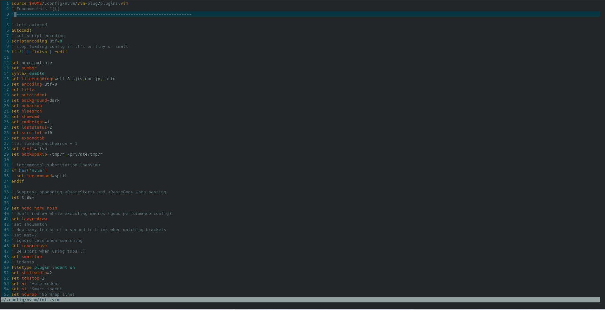

# Siblamer's dotfiles
**Warning**: Don’t blindly use my settings unless you know what that entails. Use at your own risk!
### Installing Config of Nvim
```
git clone https://gitlab.com/siblamer/dotfiles-public/
cd dotfiles-public/
cp -r .config/nvim/ ~/.config/

curl -fLo ~/.config/nvim/autoload/plug.vim --create-dirs \
    https://raw.githubusercontent.com/junegunn/vim-plug/master/plug.vim
```

After that you need to run nvim. And run 
```:PlugInstall```

### Installing ZSH config
```
sh -c "$(curl -fsSL https://raw.github.com/ohmyzsh/ohmyzsh/master/tools/install.sh)"
cd dotfiles-public/
git clone --depth=1 https://github.com/romkatv/powerlevel10k.git ${ZSH_CUSTOM:-$HOME/.oh-my-zsh/custom}/themes/powerlevel10k
cp .config/zsh/.p10k.zsh ~/ && cp .config/zsh/.zshrc ~/
```

## Contents

- vim (NeoVim) config
  - Plugins are managed with [vim-plug](https://github.com/junegunn/vim-plug)
- ZSH Oh My Zsh 
  - Framework for managing your Zsh configuration [zsh](https://ohmyz.sh/#install)
  - 
## Vim setup

Requires Neovim (>= 0.5)

- [vim-plug](https://github.com/junegunn/vim-plug) - A minimalist Vim plugin manager
- [nvim-cmp](https://github.com/hrsh7th/nvim-cmp) - A completion plugin for neovim coded in Lua
- [lspsaga.nvim](https://github.com/tami5/lspsaga.nvim) - A light-weight LSP plugin based on Neovim built-in LSP with highly a performant UI
- [defx.nvim](https://github.com/Shougo/defx.nvim) - A file explorer


## About me

- [Website: siblamer.ru](https://siblamer.ru)
- [Blog](https://blog.siblamer.ru/)
- [Email admin@siblamer.ru](mailto:admin@siblamer.ru)
